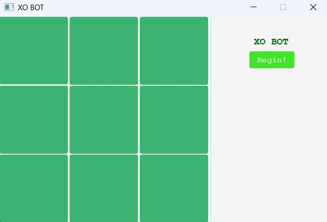
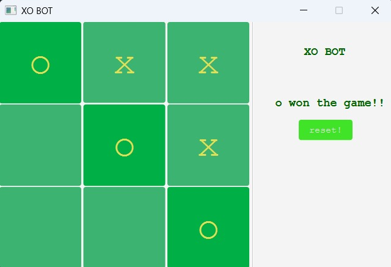
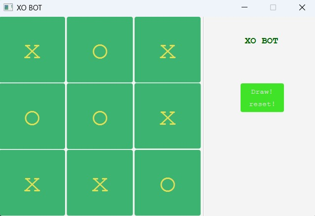

# 🎮 XO BOT - Tic-Tac-Toe Game

## Description
XO BOT 🤖 is a simple yet engaging Tic-Tac-Toe game built using JavaFX. The game allows a player to compete against a bot in a classic _3x3_ grid format. The bot employs basic **game theory** to make its moves, providing a fun challenge for players of all ages.

## Features
- 🤖 Play against a bot that makes strategic moves.**(GAME THEORY)** 
- ®️ Reset the game at the end.
- 📺 Visual feedback for winning moves.
- 🤝 Draw detection when the board is full.
- 📱Clean and user-friendly interface.
- ✅Begin button let the bot play the first move.

## WIN-RATE
- If human plays optimally **BOT forces a draw**
- If human makes a mistake **BOT WINS**

## Screenshots

### Initial GUI 
 

### Bot dominates!
<!-- Replace with actual screenshot path -->

### Humanplays optimally!!

## Technologies Used
- Java
- JavaFX
- FXML
- CSS for styling

### Prerequisites
- Java Development Kit (JDK) 11 or higher
- JavaFX SDK

### Installations
-  Instally my folder named ***XO BOT***.
-  Then setup basic jafax and run time environment,then you are good to go.
-  Run the _driver.class_,then play the game.

## About my repo
- **BASIC XO** contains 1 vs 1,in command line
- **BOT XO** conatains 1 vs BOT,in command line
- ***XO BOT*** conatains _1 vs Bot_,using GUI(**javafx**)

